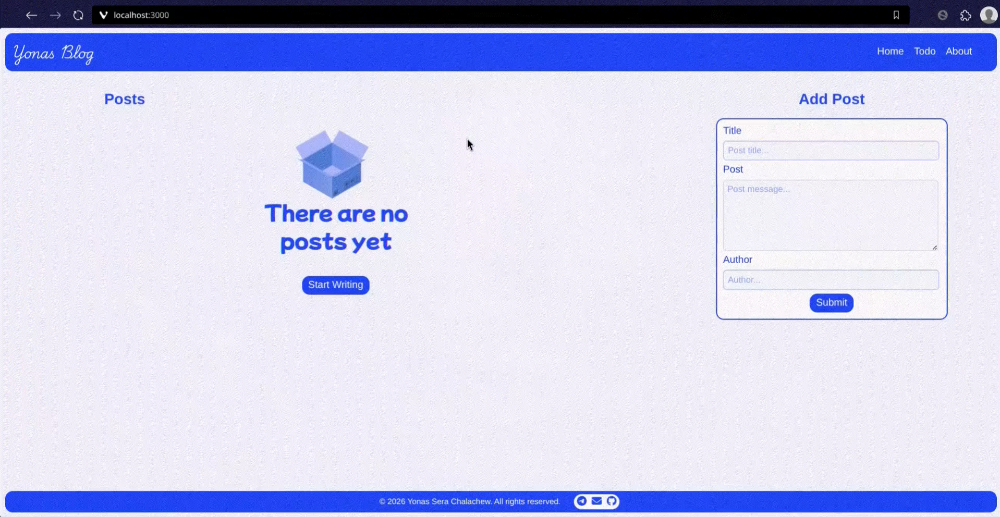
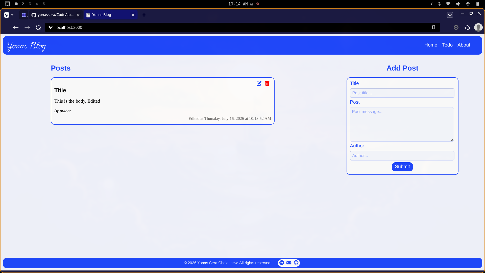
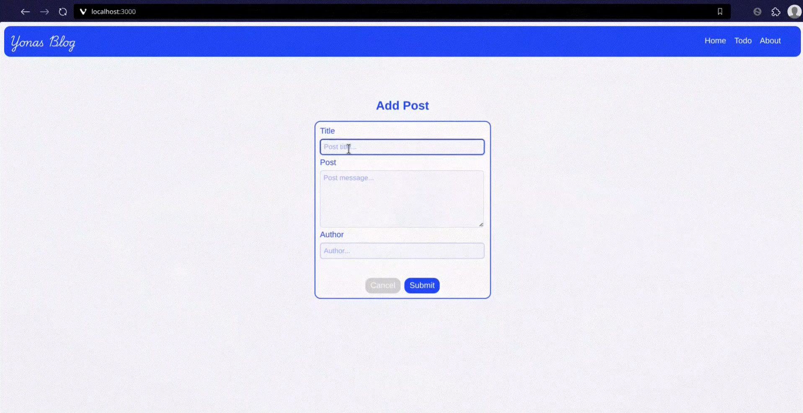
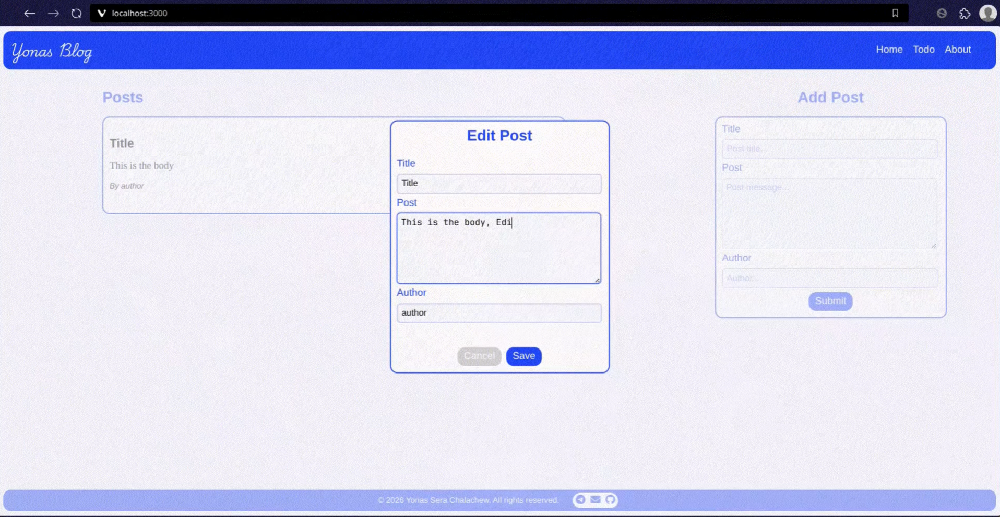
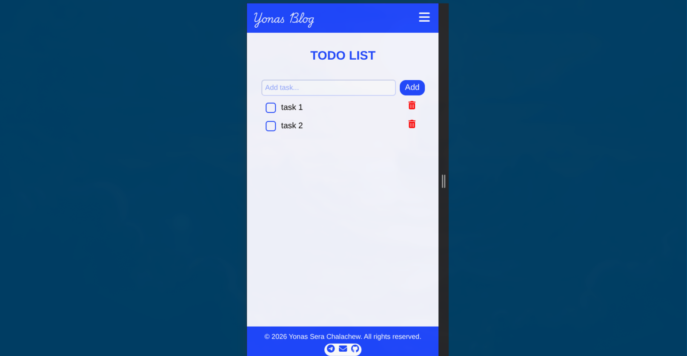
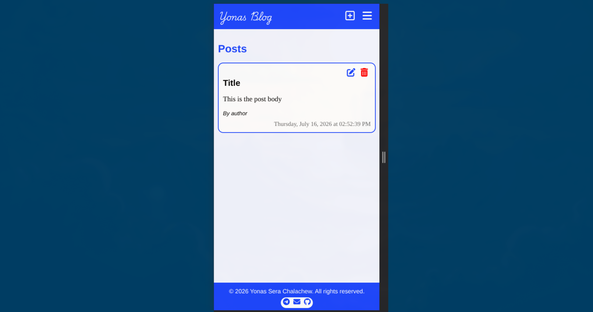
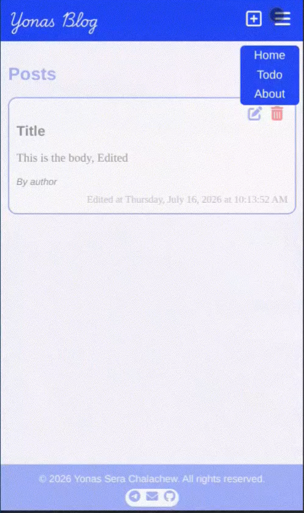
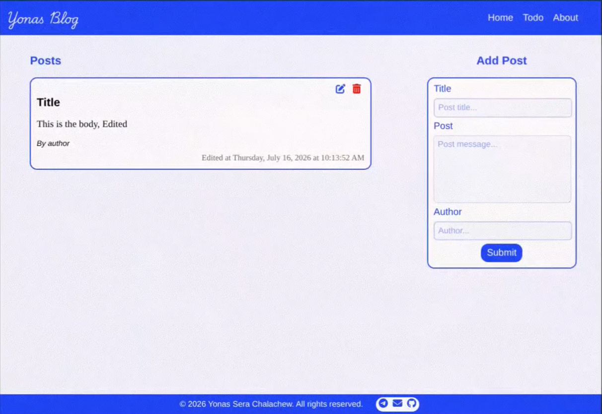

# Simple Blogging Website

A full-stack fully responsive web app built as my capstone assignment from Angela Yu's Web Development course. The project combines a blog and a to-do app, bringing together everything covered in the course HTML, CSS, JavaScript, and backend development into one cohesive project.

















## About

The goal was to practice CRUD operations in a real-world style project and connect the dots between frontend and backend development. The blog lets you write, view, edit, and delete posts, while the to-do section helps manage tasks.

## Features

**📝 Blog**

- Create new blog posts with a title, body, and author
- View all posts with timestamps
- Edit existing posts
- Delete posts

**✅ To-Do App**

- Add new tasks
- Mark tasks as complete
- Delete tasks

## Tech Stack

- **Backend:** Node.js, Express 5
- **Templating:** EJS
- **Frontend:** HTML, CSS (no frameworks), vanilla JavaScript
- **Fonts & Icons:** Google Fonts, Font Awesome

## Getting Started

### Prerequisites

- Node.js installed
- Or directly run using the link from the about section.

### Installation

```bash
# Clone the repository
git clone https://github.com/your-username/Simple-Blogging-Website.git

# Navigate into the project
cd Simple-Blogging-Website

# Install dependencies
npm install
```

### Running the App

```bash
node app.js
```

Then open your browser and go to `http://localhost:3000`.

> **Note:** Data is stored in-memory, so posts and tasks will reset when the server restarts.

## Project Structure

```
├── app.js              # Express server and route handlers
├── public/
│   ├── css/main.css    # All styles
│   ├── js/index.js     # Client-side JavaScript
│   └── images/
├── views/
│   ├── index.ejs       # Blog page
│   ├── todo.ejs        # To-do page
│   ├── about.ejs       # About page
│   └── partials/
│       ├── header.ejs
│       └── footer.ejs
└── package.json
```
